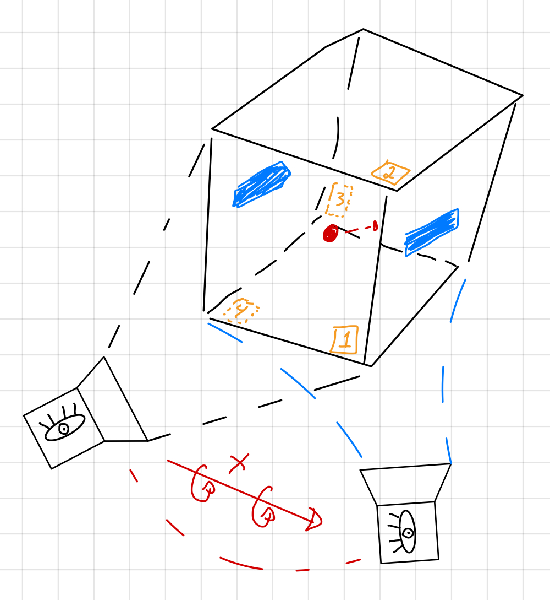
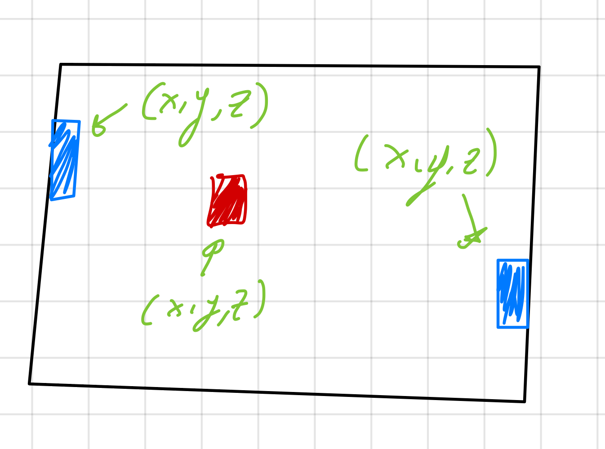
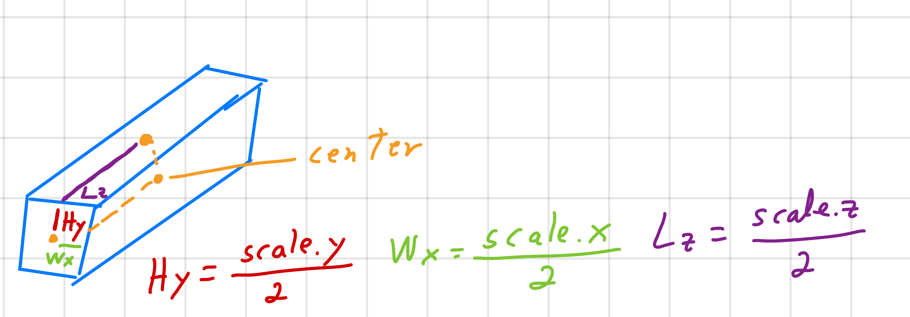

# Pong3D
Código para un juego de Pong3D multijugador distribuido usando Typescript.

---

El siguiente repositorio trata de montar un Servidor con multiples juegos asíncronos de Pong3D. Todos los archivos se encuentran bajo la carpeta [/src](./src) y están escritos en Typescript.

---

## TL/DR
Para correr el proyecto utiliza los siguientes comandos.

```console
# Instalar dependencias
> yarn

# Correr el servidor del juego y observar cambios en los archivos
> yarn watch
```

---
---

## Sobre Pong3D  

El juego de Pong3D consiste en dos jugadores y un balón dentro de un cubo, dónde el balón se encuentra en constante movimiento. Cada jugador tiene la posibilidad de anotar puntos al interactuar con el balón. Un punto es considerado cúando el balón toca la pared adyacente al jugador.

Un juego consiste en un determinado tiempo de juego. Durante este tiempo dos jugadores intentan conseguir la mayor cantidad de puntos. El jugador con más puntos al final del juego se considera el ganador.

La cámara del juego es dinámica ya que rotará sobre el eje x. En su rotación expondrá a los jugadores con cuatro distintas vistas del juego representadas por las caras del cubo. Dentro de el arreglo de posibles caras se encunetran los pares `[1, 3]` y `[2, 4]`.  

 

---

# Físicas del Juego

### Posición  

Los objetos del juego son cajas en tres dimensiones. Al estar en tres dimensiones poseen coordenadas (x, y, z) para su posición.

  

### Tamaño  

Además contienen un arreglo de escalas para cada una de las dimensiones. Estas escalas nos proporcionan el tamaño del objeto en cada una de las dimensiones.

  

## Colisiones 3D

Se puede saber si un objeto esta colisionando con otro utilizando el siguiente [algoritmo](https://developer.mozilla.org/en-US/docs/Games/Techniques/3D_collision_detection#aabb_vs._aabb).

```ts
isColliding(object: GameObject): boolean {
  return this.isCollidingX(object) &&
    this.isCollidingY(object) &&
    this.isCollidingZ(object)
}
```

Dónde para cada dimensión, se puede checar su colisión con otro objeto usando el siguiente algoritmo.

```ts
isCollidingY(object: GameObject): boolean {
  const minValue = this.position.y - this.size.y
  const maxValue = this.position.y + this.size.y
  const objectMinValue = object.position.y - object.size.y
  const objectMaxValue = object.position.y + object.size.y

  return minValue <= objectMaxValue && maxValue >= objectMinValue
}
```
> Ejemplo para la dimensión `y`

---

